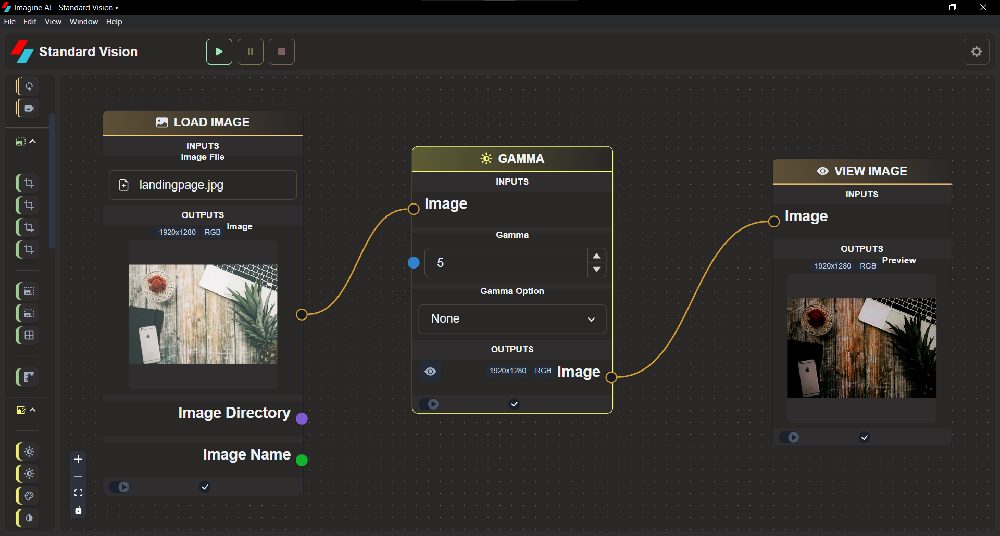
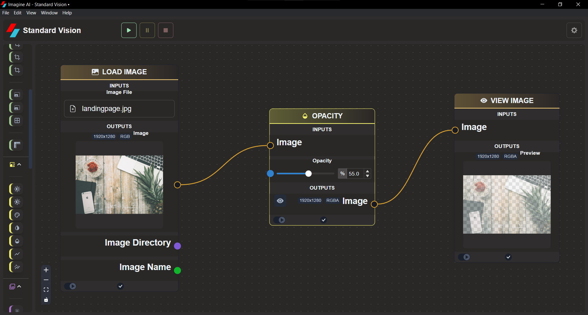

# **Adjustments**

## Brightness & Contrast

Adjust the brightness and the contrast of an image

## Gamma

Adjust the gamma of an image

## Hue & Saturation

Adjust the hue and saturation of an image. This is performed in the HSV color-space.

## Inverst Color

Invert all colors in an image.

## Opacity

Adjusts the opacity of an image. The higher the opacity value, the more opaque the image is.

## Threshold

Replace pixels based on the threshold value. If the pixel value is smaller than the threshold, it is set to 0, otherwise it is set to the maximum value.

## Threshold (Adaptive)

Similar to regular Threshold (Adaptive), but determines the Threshold (Adaptive) for a pixel based on a small region around it.

