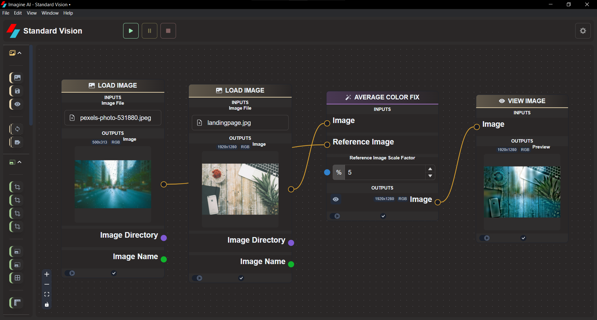
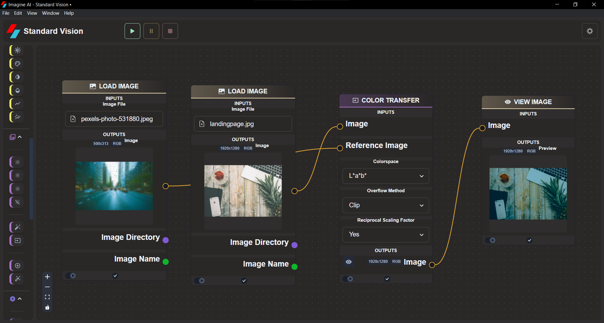

# **Correction**

## Average Color Fix

Correct for upscaling model color shift by matching average color of Input Image to that of a smaller Reference image. Using significant downscaling increases generalization of averaging effect and can reduce artifacts in the output.

## Color Transfer

Transfer colors from reference image. Different combinations of settings may perform better for different images. Try multiple setting combinations to find best results.

