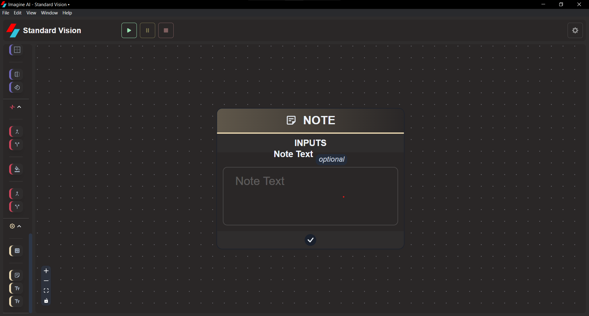

# **Text**

## Note

Make a sticky note for whatever notes or comments you want to leave in the chain

## Text Append

Append different text together using a separator string

## Text Pattern

Concatenate text using a pattern with a Python-like string interpolation syntax

